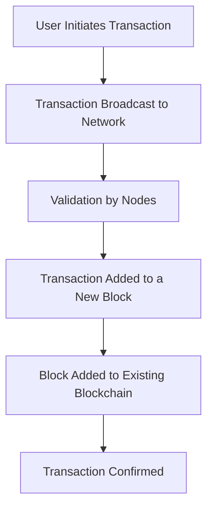

Welcome to this guide on **Blockchain**, a revolutionary technology reshaping industries from finance to supply chains. In this introduction, we’ll explore what blockchain is, how it works, and why it matters.

## 1. Definition

**Blockchain** is a distributed, decentralized ledger technology that securely records transactions across a network of computers. Each record, called a **block**, is linked to the previous one, forming a **chain** — hence the name.

### Key Characteristics:

- **Decentralized**: No central authority; data is maintained across a peer-to-peer network.
- **Immutable**: Once data is recorded, it cannot be altered or deleted without consensus.
- **Transparent**: All participants have access to the same data in real-time.
- **Secure**: Uses cryptography to secure data and prevent unauthorized changes.

:::tip Fun Fact
The first blockchain was conceptualized in 2008 by Satoshi Nakamoto and implemented the following year as a core component of Bitcoin.
:::

## 2. How Blockchain Works

Here’s a simplified workflow:

## 3. Components of a Blockchain

- **Blocks**: Containers of transaction data and metadata (like timestamps and hashes).
- **Nodes**: Computers participating in the blockchain network.
- **Hash**: A unique fingerprint for each block using cryptographic functions.
- **Consensus Mechanisms**: Rules like Proof of Work (PoW) or Proof of Stake (PoS) to validate transactions.

## 4. Real-World Applications

Blockchain has many practical uses beyond cryptocurrencies:

- **Cryptocurrency**: Bitcoin, Ethereum, and other digital assets.
- **Supply Chain**: Track goods from origin to consumer for transparency.
- **Healthcare**: Secure patient records and streamline data sharing.
- **Voting Systems**: Prevent tampering and ensure transparency in elections.
- **Smart Contracts**: Self-executing contracts with the terms coded directly.

## 5. Benefits and Challenges

### Benefits:

- Greater security and trust
- Reduced costs and faster processes
- Increased transparency

### Challenges:

- Scalability issues
- Energy consumption (especially with PoW)
- Regulatory uncertainty

## 6. Conclusion

Blockchain is not just a trend; it’s a foundational technology with the potential to transform multiple industries. Whether you’re a developer, entrepreneur, or tech enthusiast, understanding blockchain is a valuable asset for the future.