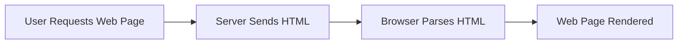

Hey, everyone!  In this guide, we’re going to explore **HTML (HyperText Markup Language)** – the foundational language of the web. HTML is the starting point for building any website or web application. It defines the **structure and content** of web pages. Let’s jump into the basics!

---

## 1. What is HTML?

**HTML** stands for **HyperText Markup Language**. It is not a programming language but a **markup language** used to define the **structure of web pages** using elements and tags.

### Key Features of HTML:

- **Structural Language**: It organizes content on a webpage using elements like headings, paragraphs, lists, and more.
- **Semantics**: HTML5 introduced semantic elements like `<header>`, `<section>`, and `<footer>` that define the meaning of content.
- **Media Integration**: Easily embeds images, videos, audio, and more.
- **Linking Content**: Connects multiple web pages using hyperlinks.

:::tip Fun Fact
HTML was created by **Tim Berners-Lee** in 1991, and it laid the foundation for the modern web!
:::

---

## 2. How Does HTML Work?

When a user accesses a web page, the browser fetches the HTML file and renders it as a visual page. The HTML provides a **blueprint** for the content structure.

### HTML Workflow



---

## 3. HTML in Action: Example

Let’s look at a basic HTML document that displays a heading and a paragraph.

```html
<!DOCTYPE html>
<html>
  <head>
    <title>My First HTML Page</title>
  </head>
  <body>
    <h1>Hello, world!</h1>
    <p>This is a simple HTML page.</p>
  </body>
</html>
```

### What’s happening here?
- **`<!DOCTYPE html>`**: Declares the document type (HTML5).
- **`<html>`**: Root element.
- **`<head>`**: Contains metadata and title.
- **`<body>`**: Contains the visible content like text, images, links, etc.

---

## 4. Where is HTML Used?

HTML is everywhere on the web. Every website you visit uses HTML in some form.

### 4.1. Web Pages
HTML forms the backbone of any static or dynamic webpage.

### 4.2. Web Applications
Combined with CSS and JavaScript, HTML powers modern web apps.

### 4.3. Emails
Most email templates use HTML to provide formatted, styled messages.

### 4.4. Documentation
HTML is used to create online documentation and user manuals.

---

## 5. Writing HTML Code

HTML uses **elements** defined by tags such as `<h1>`, `<p>`, `<div>`, etc. Tags often come in pairs: opening (`<p>`) and closing (`</p>`).

### 5.1. Common HTML Elements

```html
<h1>This is a heading</h1>
<p>This is a paragraph.</p>
<a href="https://example.com">This is a link</a>

```

### 5.2. Best Practices

- Use semantic tags for clarity and accessibility.
- Always close your tags properly.
- Use indentation to enhance readability.
- Add `alt` attributes for images to support screen readers.

---

## 6. Conclusion

HTML is the foundation of all web content. Whether you're building a personal blog or a powerful web app, mastering HTML is the first step. Stick around as we move forward into CSS and JavaScript to bring your pages to life!

---
